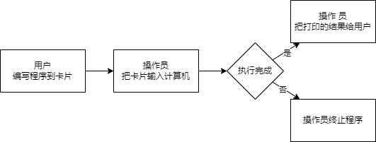

# 批处理系统

- 最早的计算机
  
- 用软件替代系统操作员的管理和操作能力——操作系统
- 批处理操作系统是一个单线程程序
- 当一个应用执行完毕，OS 将下一个要执行的应用加载到内存并执行

---

# 特权级 (Privilege)

- 产生原因
  - 一个应用程序的错误不要影响到其它应用程序、操作系统和整个计算机系统
  - 操作系统能够终止出错的应用程序，转而运行下一个应用程序
  - 保护计算机系统不受有意或无意出错的程序破坏的机制
- 具体体现
  - 应用程序运行在用户态
  - 操作系统运行在内核态
  - 实现用户态和内核态的隔离，需要计算机软件和硬件的共同努力

---

# 批处理操作系统（邓式鱼）

- 批处理：运行完第一个程序后，自动加载第二个程序并运行。

---

# 结构图

---

# 结构说明

- 加载多个 app 和 BatchOS 到内存中
- SBI 完成硬件初始化后，跳转到 BatchOS 中
- BatchOS
  - 初始化：建立栈空间和清零 bss 段
  - AppManager 内核模块将 app 加载到指定内存中在用户态执行
  - 通过系统调用的方式提供服务
